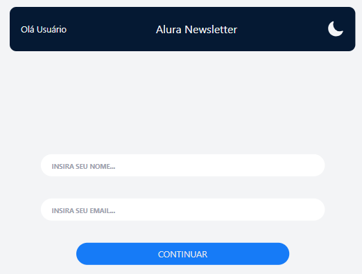
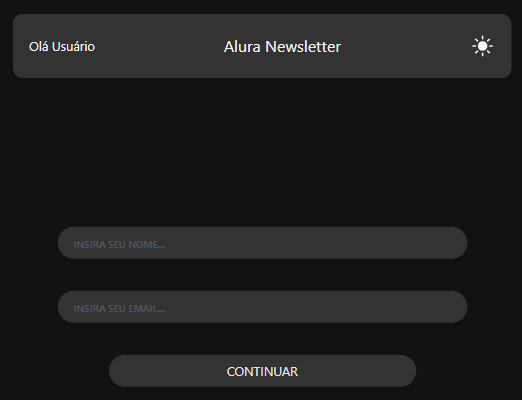
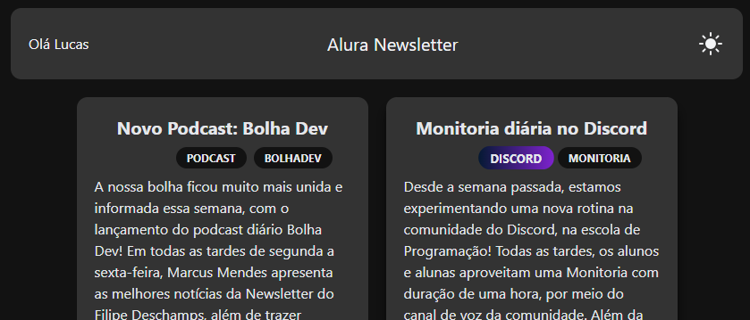

## Welcome again to another React project! 👋

# Vite + React Project

### Login
- Log-in page.



### Login Dark Mode
- Log-in page in dark mode.



### Articles
- Articles page.


### Articles Dark Mode
- Articles page in dark mode.




## Some code that I'm proud of
```js
const Form = ({ onSubmit }) => {

    const safeSubmit = event => {
        event.preventDefault()
        event.stopPropagation()
        const name = event.target[0].value
        const email = event.target[1].value
        onSubmit({ name, email })
    }

    return <form onSubmit={safeSubmit} className="flex flex-col items-center justify-center h-full -mt-20 gap-10 mx-5">
        <input className="alura-input" type="text" required placeholder="Insira seu nome..."/>
        <input className="alura-input" type="type" required placeholder="Insira seu email..."/>
        <button type="submit" className="alura-button">Continuar</button>
    </form>
}
```

## Built with

- REACT;
- Tailwind.

## Test the project yourself: [Teste the project here!!!](https://tailwind-react-eight-opal.vercel.app/)

## Author

- Website - [My GitHub](https://github.com/lucasbailo)
- Frontend Mentor - [@lucasbailo](https://www.frontendmentor.io/profile/lucasbailo)
- Instagram - [@lucassbailo](https://www.instagram.com/lucassbailo/)
- LinkedIn - [Lucas Bailo](https://www.linkedin.com/in/lcsbailo)